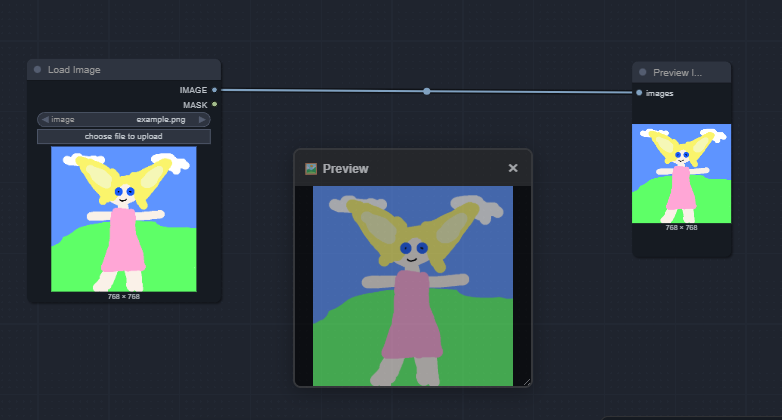

# ComfyUI Floating Preview (PiP)

A Picture-in-Picture floating preview window for ComfyUI that stays visible while you work on your workflow.

## Features

✨ **Always Visible** - Preview stays on screen while you navigate your workflow  
🖱️ **Draggable** - Move it anywhere on screen  
📐 **Resizable** - Drag the bottom-right corner to resize  
🎯 **Auto-Update** - Updates automatically when any node generates an image  
🎨 **Adjustable Opacity** - Control transparency with keyboard shortcuts (20%-100%)  
💾 **Smart Positioning** - 9 snap positions with keyboard navigation  
⌨️ **Keyboard Shortcuts** - Full keyboard control for power users  
🔄 **Works with Multiple Nodes** - Captures from PreviewImage, SaveImage, and more  
⚙️ **Highly Configurable** - Customize everything via config.json

## Installation

### Method 1: Manual

1. Download or clone this repository
2. Place the folder in: `ComfyUI/custom_nodes/`
3. Your structure should look like:
   ```
   ComfyUI/
   └── custom_nodes/
       └── ComfyUI-FloatingPreview/
           ├── __init__.py
           ├── js/
           │   └── floating_preview.js
           └── README.md
   ```
4. Restart ComfyUI
5. The preview window will appear automatically when you generate an image, or press **Ctrl+Alt+P** to toggle it manually

### Method 2: ComfyUI Manager (if available)

1. Open ComfyUI Manager
2. Search for "Floating Preview"
3. Click Install
4. Restart ComfyUI

## Usage

### Basic Usage

1. **Show/Hide**: Press **Ctrl+Alt+P** to toggle the preview window
2. The floating preview window will appear on the left side, vertically centered
3. Run any workflow - the preview updates automatically
4. **Move**: Drag the header to reposition
5. **Resize**: Drag the bottom-right corner
6. **Close**: Click the **×** button or press Ctrl+Alt+P again

### Keyboard Shortcuts

| Shortcut | Action |
|----------|--------|
| **Ctrl+Alt+P** | Toggle preview window on/off |
| **Ctrl+Alt+`+`** | Increase opacity (20% → 40% → 60% → 80% → 100%) |
| **Ctrl+Alt+`-`** | Decrease opacity (100% → 80% → 60% → 40% → 20%) |
| **Ctrl+Alt+Arrow Keys** | Move window between snap positions (relative) |
| **Ctrl+Alt+Numpad 1-9** | Jump directly to specific position (absolute) |

### Snap Positions

The preview window can snap to 9 predefined positions:

```
7 (Top Left)      8 (Top Center)      9 (Top Right)
4 (Middle Left)   5 (Center)          6 (Middle Right)
1 (Bottom Left)   2 (Bottom Center)   3 (Bottom Right)
```

**Navigation examples:**
- From center (5) press `Ctrl+Alt+↑` → Top Center (8)
- From anywhere press `Ctrl+Alt+Numpad9` → Top Right corner
- Press `Ctrl+Alt+←` repeatedly to move left through positions

### Opacity Control

The preview window supports 5 opacity levels:
- **100%** - Fully opaque (default)
- **80%** - Slightly transparent
- **60%** - Semi-transparent
- **40%** - Very transparent
- **20%** - Minimal opacity

**Tip**: Use lower opacity (40-60%) to see your workflow behind the preview while monitoring generation progress!

## Configuration

### Custom Configuration (Optional)

Create a `config.json` file in the extension folder to customize behavior:

```
ComfyUI-FloatingPreview/
├── __init__.py
├── js/
│   └── config.json  ← Create or modify this file (optional)
└── README.md
```

### Configuration Options

```json
{
  "window": {
    "defaultWidth": 320,
    "defaultHeight": 240,
    "defaultPosition": "middle-left",
    "defaultOpacity": 100
  },
  "opacity": {
    "levels": [20, 40, 60, 80, 100],
    "showIndicator": true,
    "indicatorDuration": 1000
  },
  "positioning": {
    "showPositionIndicator": true,
    "positionIndicatorDuration": 800
  },
  "ui": {
    "showHeader": true,
    "showTitle": true,
    "showCloseButton": true,
    "dragFromAnywhere": false
  },
  "behavior": {
    "autoShow": true,
    "rememberPosition": false
  }
}
```

### Configuration Examples

**Minimal UI (no header, more space for image):**
```json
{
  "ui": {
    "showHeader": false,
    "dragFromAnywhere": true
  }
}
```

**Custom opacity steps (10% increments):**
```json
{
  "opacity": {
    "levels": [10, 20, 30, 40, 50, 60, 70, 80, 90, 100]
  }
}
```

**Larger window, bottom-right corner:**
```json
{
  "window": {
    "defaultWidth": 640,
    "defaultHeight": 480,
    "defaultPosition": "bottom-right"
  }
}
```

**Start semi-transparent:**
```json
{
  "window": {
    "defaultOpacity": 60
  }
}
```

### Tips & Tricks

- **Auto-shows**: Window automatically appears when an image is generated
- **Works with multiple nodes**: Captures from PreviewImage, SaveImage, and any node that outputs images
- **Stays on top**: Always visible, even when scrolling/zooming the workflow
- **Smart positioning**: Starts on the left side to avoid blocking ComfyUI controls
- **Opacity feedback**: Shows "Opacity: X%" indicator for 1 second when adjusting
- **Lightweight**: Pure JavaScript, no dependencies

## Compatibility

- **ComfyUI**: Latest version (tested on 2024-2025)
- **Browsers**: Chrome, Firefox, Edge, Safari
- **OS**: Windows, macOS, Linux
- **Frontend**: Compatible with both legacy and new ComfyUI frontends

## Troubleshooting

### Preview not showing?

1. Make sure you have a **PreviewImage** or **SaveImage** node in your workflow
2. Check browser console (F12) for errors
3. Try pressing **Ctrl+Alt+P** to manually toggle
4. Refresh the page (Ctrl+R)

### Button not appearing in menu?

~~The extension doesn't use a menu button~~ - just use **Ctrl+Alt+P** to toggle the preview! This keeps the interface clean and works reliably across all ComfyUI versions.

### Keyboard shortcuts not working?

1. Make sure you're not typing in an input field
2. Try clicking on the ComfyUI canvas first
3. Check browser console for conflicts with other extensions

### Can't drag/resize?

1. Make sure you're dragging the **header** (top bar with "🖼️ Preview")
2. For resizing, drag the **bottom-right corner**
3. Try refreshing the page

## Development

### File Structure

```
ComfyUI-FloatingPreview/
├── __init__.py              # Python registration (minimal)
├── js/
│   └── floating_preview.js  # Main extension code
└── README.md                # This file
```

### How it works

1. Registers as a ComfyUI extension
2. Listens to the `executed` event from ComfyUI API
3. Captures image output from any node that produces images
4. Updates the floating preview window in real-time
5. Pure client-side (no backend processing)

### Customization

**Without config file** - Uses sensible defaults  
**With config file** - Full control over every aspect

Default values work great for most users. Create `config.json` only if you need specific customization.

## Roadmap

- [x] Keyboard shortcuts (Ctrl+Alt+P)
- [x] Opacity control
- [x] Smart snap positioning (9 positions)
- [x] Configuration system (config.json)
- [x] Multi-node support (PreviewImage, SaveImage)
- [x] Configurable UI (header, title, buttons)
- [ ] Zoom/Pan within preview
- [ ] Pin/Unpin feature
- [ ] Click through to ComfyUI

## Version History

### v1.2.0 (Current) 
- ✅ Added full configuration system (config.json)
- ✅ Implemented 9-position snap system
- ✅ Added relative navigation (Ctrl+Alt+Arrows)
- ✅ Added absolute positioning (Ctrl+Alt+Numpad 1-9)
- ✅ Configurable UI (header, title, close button)
- ✅ Position change indicators
- ✅ Custom opacity levels support

### v1.1.0
- ✅ Added opacity control (Ctrl+Alt+[+/-])
- ✅ Changed default position to left-center
- ✅ Added support for SaveImage nodes
- ✅ Improved keyboard shortcut handling
- ✅ Added temporary opacity indicator

### v1.0.0
- ✅ Initial release
- ✅ Basic floating preview window
- ✅ Drag and resize support
- ✅ Auto-update on image generation

## Credits

**Created by**: Gmorks (with Claude AI assistance)  
**Inspired by**: YouTube's Picture-in-Picture feature  
**License**: MIT

## Support

Having issues? Want a feature?
- Open an issue on GitHub
- Describe your ComfyUI version and browser
- Include console errors if any (F12 → Console tab)

---

**Enjoy your floating preview!** 🎉

*Made with ❤️ for the ComfyUI community*